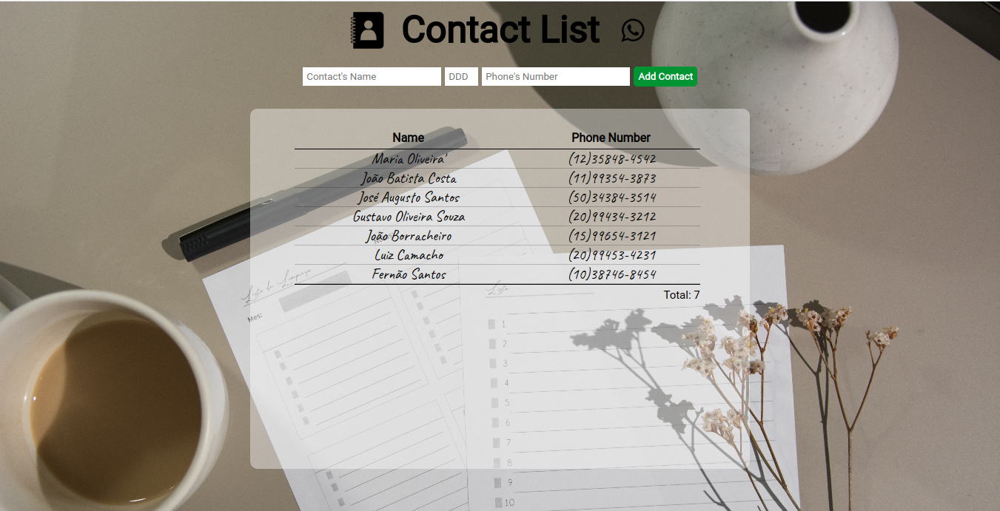

# Projeto Lista De Contatos 
## Projeto realizado em HTML, CSS, JS como tarefa parte do Curso Profissionalizante Desenvolvedor Web Full Stack Python

### Features
* Manipulação do DOM no HTML pelo JS;
* Lógica no JS para adicionar um novo contato;
* Restrição para não adicionar um contato repetido com o mesmo nome;
* Uso de hash para armazenar os contatos inseridos;
* Obrigatoriedade de fornecimento de dados antes de submeter o formulário;
* Restrição do número de dados inseridos; 
* Manipulação dos dados inseridos para exibição na página após estilização;
* Estilização com o CSS;
* Uso de tag 'table' e suas tags semânticas no HTML.  

